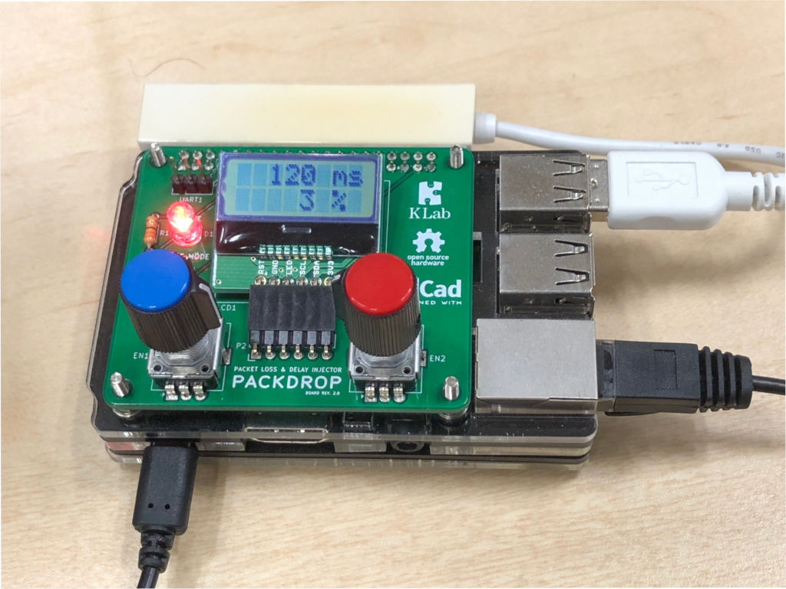

# PACKDROP

Raspberry Pi based Handmade Network Emulator (Packet loss and delay injector)



## SD Image

### for BOARD REV. 2.0

+ [PACKDROP_2.0a.img](https://drive.google.com/file/d/1GBg2wHwh6UmLzyU2K1rythLRL9IAEKmV/view?usp=sharing) (Google Drive)

```
$ dd if=PACKDROP_2.0a.img of=/dev/sda bs=1m
```

*This image can be used with both Raspberry Pi 2B or 3B/3B+ (or 4B).*

### for BOARD REV. 1.2 or older

+ [PACKDROP_1.2.1.img](https://drive.google.com/file/d/0ByIrBGkSig1Pb3QyajJXTXBhd1U/view?usp=sharing) (Google Drive)

```
$ dd if=PACKDROP_1.2.1.img of=/dev/sda bs=1m
```

*This image can be used with both Raspberry Pi 2B or 3B.*

## Configuration

The following files are copied from sdcard to rootfs at boot time.

- interfaces.txt -> /etc/network/interfaces
- hostapd.txt -> /etc/hostapd/hostapd.conf

The target interface is a member of br0.<br/>
By setting these files, you can also use the vlan interface.
